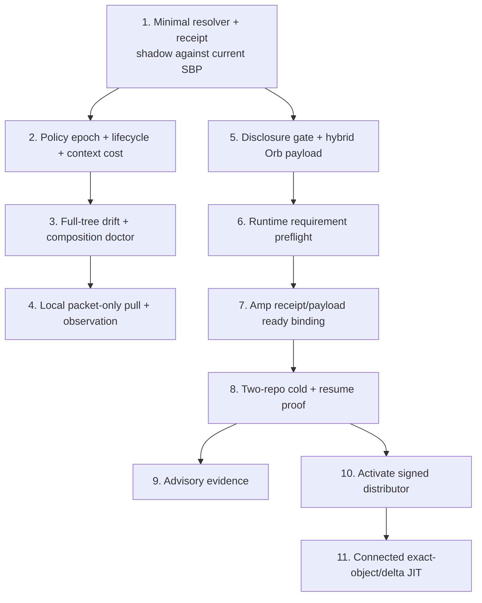

# Dueling Idea Wizards Report: Just-in-Time Skills Everywhere

> Evidence record. The execution-grade successor is
> [JIT_SKILLS_EXECUTION_PLAN_20260728.md](JIT_SKILLS_EXECUTION_PLAN_20260728.md).
> This file retains the original duel methodology, scoring, and synthesis.

Date: 2026-07-27  
Project: `opensource/skillbox` plus the `skillbox-config` Amp/DWS control plane  
Mode: architecture  
Focus: all the right skills, in the right execution environments, at the right time

## Executive summary

Two independently generated five-proposal architectures were cross-scored,
revealed, and revised. The strongest independent convergence was a single,
read-only SBP resolution contract: Claude scored Codex's receipt proposal
800/1000; Codex scored Claude's resolver proposal 868/1000.

The original transport proposals did not survive intact. Claude's committed
projection default scored 286/1000 from Codex because private/shared skill
content would persist in product-repo history and could not support true
mid-run JIT. Codex's signed-bundle capsule scored 590/1000 from Claude because
the distributor implementation exists but no live client channel or cold-Orb
fixture currently makes it an operational v1 primitive.

The reveal produced a smaller hybrid:

1. Every execution starts with the dispatcher floor: `smart`, `/sbp`, and a
   verifier.
2. One `SkillResolutionReceipt/v1` decides exact names, full-tree hashes,
   reasons, omissions, policy epoch, lifecycle state, and estimated context
   cost.
3. Persistent boxes retain their durable Claude/Codex homes. Session prime is
   read-only; JIT pull returns an instruction packet immediately and does not
   create or delete shared TTL links.
4. Cold Orbs receive a bounded admitted set:
   - repo-owned, already visibility-compatible skills may ride the pinned repo;
   - shared/private skills use a controller-sealed ephemeral payload and never
     enter product-repo history.
5. Amp receipt and payload digests bind to the existing lease, fence, runtime
   epoch, capsule, and atomic readiness gate. Local interactive sessions do not
   invent Amp-style authority.
6. Evidence remains advisory and non-causal. Delivery is not use; use is not
   success; absence is not prune evidence.

The end-state can add connected exact-object JIT after the signed distributor
and Orb gateway are proven. V1 prepositions a bounded allowed candidate set and
activates instructions just in time from local verified bytes.

## Methodology

- Claude contender: pane `claude-alpha`; NTM did not report a live model field,
  so runtime model is recorded as `unknown`. Spawn requested `fable:xhigh`; the
  artifact self-reported Claude Fable 5, but that is not substituted for robot
  observation.
- Codex contender: pane `codex-bravo`; live UI reported `gpt-5.6-sol high`.
  Spawn requested `gpt-5.6-sol:xhigh`; observed `high` is authoritative.
- Each contender generated 30 candidates and winnowed to five.
- Each read and scored the other's complete artifact on a 0-1000 scale.
- Both completed a reveal reaction with explicit concessions and rebuttals.
- Both completed a three-item blind-spot probe.
- No Beads were created, updated, or closed.

## Score matrix

### Directly comparable themes

| Theme | Claude score on Codex | Codex score on Claude | Average | Verdict |
|---|---:|---:|---:|---|
| One resolver / exact receipt | 800 | 868 | **834** | Consensus winner |
| Advisory evidence recalibration | 705 | 671 | **688** | Survives after semantic correction |

### Architecture-specific proposals

| Proposal | Origin | Opponent score | Verdict after reveal |
|---|---|---:|---|
| Amp execution-bound availability | Codex | 730 | Keep Amp half; remove invented local lease |
| Full-tree drift doctor / content lock | Claude | 618 | Keep read-only doctor; machine state stays untracked |
| Signed resolved skill capsule | Codex | 590 | Remove from v1 critical path; retain upgrade path |
| Session prime + TTL shared-link pull | Claude | 552 | Keep prime diagnostics and packet pull; kill TTL mutations |
| Full per-session skill homes | Codex | 540 | Defer on persistent boxes; use observations first |
| Committed skill projection | Claude | 286 | Allow only repo-owned/visibility-compatible bootstrap content |

## Consensus winners

### 1. Minimal `SkillResolutionReceipt/v1`

The resolver is the one policy decision point for local sessions, NTM workers,
managed boxes, and DWS campaigns.

V1 request inputs:

- canonical repo identity and exact repo SHA;
- cwd-relative location;
- agent surface and environment profile;
- explicit requested skill names;
- explicit overlay names;
- current repo override and canonical policy.

V1 receipt outputs:

- `allow|partial|deny`;
- selected, available-on-demand, omitted, and required-missing skills;
- source repository and exact source SHA;
- full-tree SHA plus entry-file SHA;
- existing SBP reason codes and activation class;
- canonical policy bytes digest;
- `policy_epoch` and `policy_dirty`;
- lifecycle: `active|deprecated|superseded|retired`;
- estimated context/token cost per selected skill and total;
- one canonical receipt digest.

No typed task-capability ontology, dedicated resolver key, local lease, cache,
or role enum is required in v1. Free-form task matching may suggest candidates;
it cannot silently activate them.

### 2. Packet-only local JIT

Persistent Skillbox homes remain persistent.

```text
launcher/session start
  -> sbp session prime (read-only)
  -> exact receipt + drift/composition diagnostics
  -> agent starts with reviewed durable links

/sbp pull <skill>
  -> policy recheck
  -> full instruction packet returned in the same response
  -> delivery observation recorded
  -> no shared link mutation
```

Durable visibility still uses the current explicit reviewed verbs:

- `sbp skill on`;
- `sbp skill heal`;
- `sbp skill default on --repo`;
- global changes through the existing dry-run plus explicit apply gate.

Required skills can gate a managed launcher. Unmanaged interactive shells get a
high-severity diagnostic rather than a false claim that every shell is
force-gated.

### 3. Hybrid cold-Orb payload

The cold Orb always carries `/sbp` and the verifier as materialized bytes, not
host-only symlinks.

The resolver divides the admitted set:

| Skill class | V1 transport |
|---|---|
| Repo-owned and intentionally committed there | Pinned checkout pointer plus full-tree verification |
| Shared public skill | Controller-sealed ephemeral payload |
| Shared/private operator skill | Ephemeral payload only after explicit external-disclosure allow |
| Not admitted for this campaign | Metadata may be discoverable; body activation returns `SKILL_NOT_AVAILABLE_IN_CAMPAIGN` |

Payload shape:

```text
orb-skill-payload/
  resolution-receipt.json
  skill-index.json
  trees/<tree-sha>/...
```

Startup-selected skills are injected before the first turn. A bounded
`available_on_demand` set is prepositioned but not injected. `/sbp pull`
verifies and returns a pre-admitted instruction packet in the same turn.

This is just-in-time activation without making v1 depend on a hosted fetch
service. A later exact-object gateway can fetch a newly admitted signed bundle
when measured demand proves the prepositioned bound insufficient.

### 4. Amp-only execution binding

Skill policy and execution authority remain independent gates.

```text
check live campaign fence
  -> verify repo SHA + receipt + payload
  -> materialize disposable Orb skill directory
  -> verify runtime requirements and composition
  -> recheck live fence
  -> atomically publish ready.json
```

Resume verifies:

- campaign/thread identity;
- repo-set lease and fence;
- runtime/control-plane epoch;
- repo SHA;
- capability capsule digest;
- skill resolution receipt digest;
- skill payload/view digest.

Mismatch quarantines. Background repair cannot set ready. Ordinary local
sessions do not acquire a fake skill lease.

### 5. Honesty-walled evidence

Evidence facts:

- offered;
- selected;
- packet delivered;
- acknowledgement known/unknown;
- explicit consulted self-report, if any;
- task validation result;
- typed integrity/policy/transport failure.

There is no causal `skill-success` event. Evidence may recommend prefetch,
repo-scoped defaults, metadata fixes, or exact-hash quarantine. It cannot:

- add to the global allowlist;
- enable global overlays;
- treat activation as usefulness;
- prune from mere absence;
- infer execution authority.

This work should extend deferred mion `.32`/`.33` rather than create competing
verbs. `promote --suggest` can advance after trustworthy events exist;
absence-based prune remains deferred until collection completeness and
rare-safety-skill exclusions are proven.

## Blind spots discovered after the duel

### A. External disclosure is separate from transport integrity

A hash-perfect private skill can still be an unauthorized disclosure to Amp or
another provider.

Add a distinct default-deny policy:

```yaml
external_disclosure:
  amp_orb: deny
```

`orb_compatible` or `orb_safe` does not imply permission to disclose the full
tree. The disclosure gate runs before the payload builder reads the content.

### B. Present does not mean executable

The existing Orb setup proves Python, git, disk, compilation, and one unittest.
It does not prove required `br`, `bv`, `ntm`, `sbp`, MCP tools, network classes,
writable roots, or mutation authority.

Curate runtime requirements only for the exact skills in the initial two-repo
proof. Required unsatisfied dependencies fail with
`SKILL_RUNTIME_REQUIREMENT_MISSING`; optional skills are explicitly omitted.

### C. Individually valid skills can conflict as a set

Before instruction delivery, run a deterministic composition check:

- delivery order;
- total entry bytes and estimated model tokens;
- duplicate instruction blocks;
- known exclusive groups;
- combined-set digest.

Do not attempt general semantic theorem proving. Measure, order, budget, and
test the actual combined set.

### D. Context-window cost is the missing objective function

The live study found 42 Claude skill entries versus 37 Codex entries, including
stale `.bak` directories. Every visible description consumes session context.

Add receipt/report fields for per-skill and total description cost plus an
optional repo/category budget. This makes JIT measurable:

```text
task-relevant skill hit rate / context tokens exposed
```

### E. Skill retirement and rename are unmodeled

Add lifecycle state to the receipt now. Inventory should classify
`<name>.bak.*` real directories as lifecycle debris. `deprecated_since` and
`superseded_by` can support one redirect window before retirement becomes a
lint failure.

### F. Policy distribution is currently ambient

Every box can resolve against a different or dirty `skill-scope.yaml`.
Stamp `skillbox-config` HEAD and `policy_dirty` into every receipt. Doctor warns
on dirty or stale policy and cross-box evidence can expose epoch divergence.

### G. Task-context provenance is part of JIT correctness

This duel's fresh NTM session received unrelated clipboard-Bead recovery
context at spawn and later received a stale queued “SYNTHESIS PHASE” prompt.
Both were stopped before source mutation.

The skill system can deliver the right skill and still act on the wrong task.
Orb/session bootstrap therefore needs:

- task/campaign-bound recovery context;
- provenance and generation identifiers on injected context;
- rejection of recovery packets whose execution identity does not match;
- no generic “continue where you left off” injection into a newly labeled
  session.

This is an observed failure, not a hypothetical.

## Killed ideas

- Central always-online skill daemon.
- Cross-box push bus as the source of truth.
- Semantic task classifier silently activating skills.
- Autonomous global promotion.
- TTL cleanup of shared project links.
- Body-only `SKILL.md` identity.
- Absence-based pruning without completeness proof.
- Full per-session Claude/Codex homes in v1.
- Signed distributor as a prerequisite before an executed live fixture.
- Private/shared skill vendoring into product-repo history.
- Role-enum policy axes mixing trust, topology, and execution role.
- New local skill leases.
- General CAS/refcount/LRU/delta-gateway machinery before cold proof.

## Recommended execution sequence



## Bead mapping

Use the existing program; do not create another epic.

| Work | Natural owner |
|---|---|
| Executor carries repo/environment/resolution identity | `skillbox-config-box-orb-duties-yk28.4` |
| Hybrid payload, disclosure gate, full-tree verifier, `/sbp` bootstrap | `skillbox-config-box-orb-duties-yk28.8` |
| Receipt/payload/view digests and fence-bound readiness | `skillbox-config-box-orb-duties-yk28.9` |
| Two-repo cold/resume, non-admitted denial, runtime/composition proofs | `skillbox-config-box-orb-duties-yk28.11` |
| Real DWS transport and closeout evidence | `skillbox-config-amp-dws-complete-vision-zuk6` |
| Resolver/receipt, drift doctor, packet-only pull | One new focused Skillbox child Bead |
| Advisory promotion | Existing deferred mion `.32`, after evidence contract |
| Evidence-based prune | Keep mion `.33` deferred |
| Distributor activation fixture | One bounded spike, then decide whether to extend `.8` |

Suggested acceptance additions to `yk28.11`:

1. Cold Orb starts without the operator home and contains materialized `/sbp`.
2. `/sbp` lists the campaign's allowed startup and on-demand skills.
3. Startup instructions are available first turn.
4. One pre-admitted on-demand skill returns a usable packet in the same turn.
5. One non-admitted skill fails explicitly.
6. One disclosure-denied private skill never enters the payload.
7. Required runtime commands/tools are executed and proved present.
8. Combined skill set passes deterministic ordering and context budget.
9. Corrupt tree/path/payload fails before readiness.
10. Resume succeeds with the same fence and fails after reacquisition/epoch
    change.
11. Two concurrent Orbs have isolated admitted sets.
12. Evidence leaves global policy byte-for-byte unchanged.

## Final recommendation

Build the resolver first, then the smallest cold-Orb bridge.

The decisive boundary:

> Policy selects exact trees. Disclosure policy decides whether they may cross.
> Transport supplies bytes. Runtime preflight proves they are usable.
> Composition proves they fit together. `/sbp` injects instructions only when
> needed. Existing execution authority controls Amp lifetime. Evidence proposes
> scoped improvements but never widens authority.

That is the simplest complete interpretation of “all the right skills in the
right places at the right times.”
