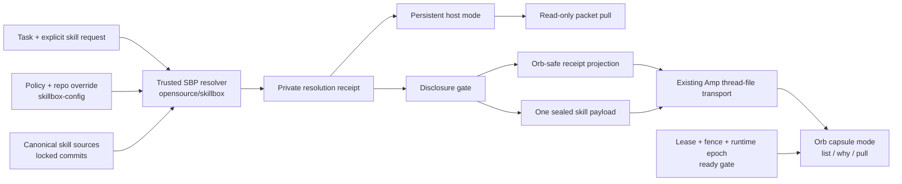

# Just-in-Time Skill Delivery Across Persistent Boxes and Amp Orbs

- Date: 2026-07-28
- Status: draft architecture plan; ready for human architecture review, not yet
  an accepted execution graph
- Scope: `opensource/skillbox`, `skills-private`, `skillbox-config`, persistent
  Claude/Codex homes, NTM panes on those homes, and disposable Amp Orbs
- Evidence base: the 2026-07-27 dueling-wizards artifacts plus live repository,
  CLI, filesystem, and Beads inspection on 2026-07-28

## Decision

Use one trusted resolver and two delivery modes:

1. **Persistent-host mode** — full SBP policy evaluation runs on the box.
   `/sbp` can inspect, explain, and return a skill packet without changing links.
2. **Amp-campaign mode** — the trusted controller resolves before launch. The
   Orb receives a disclosure-safe receipt projection, a bounded content-addressed
   payload, and a tiny read-only SBP capsule reader. The Orb may list, explain,
   and pull only what the controller admitted.

Keep one command vocabulary in both modes:

```text
sbp capabilities --json
sbp skill resolve --format json
sbp skill why <name> --format json
sbp skill pull <name> --format json
```

`pull` is the new non-mutating primitive. Existing `activate` keeps its current
link-plus-packet behavior. No command silently changes meaning by environment.

The simplest correct control-plane floor is environment-specific:

| Environment | Required bootstrap/core | Why |
|---|---|---|
| Persistent interactive box | `smart` + `sbp` | `smart` dispatches; `sbp` resolves and delivers |
| NTM pane sharing that box home | Same host floor | It is another process on the same explicit home |
| Amp Orb | `/sbp` router + read-only `sbp` capsule reader | DWS already dispatched the work; `smart` would duplicate dispatch |
| DWS campaign | Orb SBP bootstrap plus the campaign's resolved base/task skills | Current base skills are `beads-br`, `divide-and-conquer`, and `do-work-son` |

This table defines the JIT control-plane floor, not the complete current global
visibility set. Existing reviewed operator-global exceptions remain governed by
`skill-scope.yaml`; reducing that set is a separate policy decision.

Do not add a third always-global “verifier” skill. Verification is an SBP
responsibility and a readiness gate, not another instruction surface.

V1 provides **just-in-time activation from locally verified bytes**. It does not
promise arbitrary mid-campaign network fetch. Connected exact-object fetch is a
measured upgrade, not a launch dependency.

## Core Value Gate

- **Primary actor:** an agent already placed in a persistent session or admitted
  Amp campaign.
- **User-visible outcome:** the agent can invoke `/sbp`, see the skills actually
  available in that environment, and receive one exact skill's instructions in
  the same turn.
- **Minimum winning slice:** read-only host resolution and packet pull; explicit
  Orb SBP bootstrap; one sealed bounded payload; cold/resume proof across two
  repositories.
- **Safety outcome:** no private skill disclosure, policy widening, stale-fence
  reuse, or hidden filesystem mutation.
- **Non-goals:** an always-online daemon, autonomous semantic activation,
  full per-session homes, private skill vendoring into product history, global
  auto-promotion, absence-based pruning, delta/CAS machinery, or a new scheduler
  inside the Orb.
- **Debt avoided:** no second policy engine in the Orb, no new signing authority
  for V1, no compatibility rewrite of existing SBP verbs, and no hosted service
  before one real consumer proves the need.

## Precise Vocabulary

“JIT skills” previously conflated five different events. This plan keeps them
separate:

| Event | Meaning | V1 timing |
|---|---|---|
| Discover | Enumerate disclosure-permitted metadata | On `/sbp`; catalog already local |
| Resolve | Apply authoritative policy and produce exact decisions | Host request or controller pre-launch |
| Materialize | Put verified skill-tree bytes in the environment | Already installed on host; pre-launch for Orb |
| Activate | Return `SKILL.md` instructions to the current agent turn | Just in time |
| Persist | Make a skill visible to future sessions | Existing reviewed host verbs only; forbidden in Orb |

The V1 claim is therefore:

> Discovery and activation are same-turn. Orb admission and materialization are
> pre-launch. Arbitrary network materialization is deferred.

## Current-State Evidence and Gaps

| Fact observed 2026-07-28 | Consequence |
|---|---|
| `_skill_common.py:48` defines the dispatcher floor as exactly `("smart", "sbp")`. | A third verifier floor would contradict current policy and add context cost. |
| `/home/skillbox/.local/bin/sbp` is a symlink to this repo's `scripts/sbp`. | Persistent-host CLI availability depends on an explicit host checkout. |
| Claude's `/home/skillbox/.claude/skills/sbp` points to `skills-private/sbp`; Codex's `/home/skillbox/.codex/skills/sbp` points to a copied tree under `/srv/skillbox/home`. Their `SKILL.md` SHA-256 values differ. | “Globally installed” does not currently mean byte-identical across agent surfaces. |
| No `/home/skillbox/.agents/skills/sbp` exists. | A cold Orb cannot inherit `/sbp` from the operator home. |
| The current SBP skill says the global set is 15 skills, while current `skill-scope.yaml:25-26` says 18. | Prose counts are already stale; receipts must derive from machine policy. |
| `lifecycle.py:480-517` builds an activation packet from `SKILL.md` and its entry-file hash; `activate` also plans links. | Reuse packet construction, but add a truly read-only `pull` and full-tree identity. |
| `sbp skills --issues-only --json` produced no output before a measured 30-second timeout. | The current full audit path cannot be the same-turn resolver path. |
| `.agents/setup:78-121` requires Python/git and runs compilation plus one unittest, but does not install or verify SBP. | Orb SBP must be a declared bootstrap artifact, not an assumption. |
| `amp_dws_dispatch.py:1243-1251` says repo skills are resolved via SBP at bootstrap, but no executable/content delivery contract backs that sentence. | The control plane has the right noun but lacks the materialized seam. |
| `amp_dws_dispatch.py:583-624` already seals and uploads an exact campaign snapshot plus attachments. | V1 should extend this thread-file transport instead of building a hosted fetch service. |
| `docs/skills.md:94-168` and `distribution/` already implement signed manifest/bundle sync and rollback. `docs/ROADMAP.md:50-51` still defers the hosted service and short-lived token exchange. | Reuse bundle validation code; do not mislabel the hosted distributor as production-ready. |
| `orb-capability-capsule.schema.json` already caps artifacts at 32 and 6,000,000 bytes each. | Pilot payload bounds can align with an existing contract. |

## Architecture



### Authority boundary

- The trusted host/controller reads global policy, repo overrides, source roots,
  source Git state, and disclosure policy.
- The Orb receives decisions. It does not re-evaluate operator policy from a
  partial checkout and cannot widen its admitted set.
- OIDC identifies an Orb/thread. Lease ID, fencing token, runtime epoch, repo
  SHA, and payload digests establish execution authority.
- `skillbox-env exec`, `/sbp`, or the agent prompt are not security boundaries.
  Enforcement remains at payload construction, launcher, gateway, and receipt
  validation.

### One `/sbp`, two backends

The canonical `sbp` skill should become a thin router:

1. Run `sbp capabilities --json`.
2. If `mode=host`, use the full host recalibration/reference workflow.
3. If `mode=campaign-capsule`, use only read-only list/why/pull operations.
4. If neither backend is available, report `SBP_ENVIRONMENT_UNSUPPORTED`.

Move the current long host-only procedure into a host reference. Add a compact
campaign reference. `skill-issue` and `lube` become host remediation skills
activated when needed, not hard dependencies that every Orb must carry.

The installed Claude and Codex copies must both resolve to the same canonical
source-tree digest. Paths may differ by machine; content identity may not.

## Policy and Selection

### Precedence

Keep the current durable precedence:

```text
dispatcher floor
  > repo override (.skillbox/skill-overrides.yaml)
  > global defaults and cwd rules (skill-scope.yaml)
  > source availability
```

External disclosure, lifecycle, runtime compatibility, and composition are
subsequent narrowing gates. They can remove a candidate; they cannot grant one.

### Deterministic selection algorithm

For each environment:

1. Identify canonical repositories and exact base SHAs.
2. Load the current repo override plus canonical `skill-scope.yaml`.
3. Resolve the environment floor:
   - host: `smart`, `sbp`;
   - Orb: SBP bootstrap outside the task-skill budget.
4. Add environment-specific campaign base skills when the campaign type
   requires them.
5. Add literal repo-required and explicitly requested task skills.
6. Treat free-form task matching as suggestions only; never silently activate.
7. Apply lifecycle policy.
8. Apply external-disclosure policy to metadata and body separately.
9. Verify canonical source commit, full-tree digest, and entry digest.
10. Check declared runtime requirements.
11. Check combined ordering, exclusive groups, and instruction budget.
12. Sort deterministically by `required`, `explicit`, `repo-policy`, then name.
13. Fail if a required skill cannot fit. Omit optional overflow with an exact
    private reason and a disclosure-safe Orb projection.
14. Seal the receipt/projection/payload digests before Amp is called.

### Disclosure

Transport integrity is not permission to disclose.

Use a controller-side policy with three states per target:

```yaml
external_disclosure:
  amp_orb: none | metadata | body
```

Rules:

- Default for `skills-private` is `none`.
- Repo-owned public skills may default to `body` only when their repository
  policy explicitly admits them.
- `orb_safe` or runtime compatibility never implies disclosure permission.
- Source frontmatter may narrow disclosure; it cannot widen central policy.
- A metadata-denied skill's name, description, source path, and precise denial
  reason do not enter the Orb.
- An Orb request for an unknown or undisclosed name returns the same
  `SKILL_NOT_AVAILABLE_IN_CAMPAIGN` response.

## Versioned Contracts

### `SkillResolutionRequest/v1`

| Field | Required | Contract |
|---|---|---|
| `schema_version` | yes | Literal `skill-resolution-request/v1` |
| `request_id` | yes | Unique, caller-supplied idempotency key |
| `mode` | yes | `host` or `amp_campaign` |
| `surface` | yes | `claude`, `codex`, `amp_coordinator`, or `amp_worker` |
| `repositories[]` | yes | Canonical ID, exact base SHA, and cwd within the environment |
| `explicit_skills[]` | yes | May be empty; names only |
| `task_tags[]` | yes | May be empty; advisory, bounded strings |
| `task_context_sha256` | yes | Digest only; raw prompt is excluded |
| `campaign_binding` | Amp only | Campaign/thread, lease ID, fence, runtime epoch, and capability-capsule digest |

The caller cannot supply authoritative policy bytes, source paths, disclosure
grants, or execution authority.

### `SkillResolutionReceipt/v1`

This is the controller-private source of truth.

| Field | Contract |
|---|---|
| `schema_version` | Literal `skill-resolution-receipt/v1` |
| `resolution_id`, `request_id`, `created_at` | Correlation and time |
| `mode`, `surface`, `repositories` | Canonical execution context |
| `policy` | Config repo SHA, policy SHA-256, repo-override SHA-256, `policy_dirty`, monotonic policy epoch |
| `binding` | `null` on host; exact campaign authority tuple on Amp |
| `skills[]` | One decision per considered controller-visible candidate; Orb disclosure is handled only by the projection |
| `composition` | Ordered startup names, combined-set digest, estimated tokens, conflicts |
| `totals` | Selected, on-demand, omitted, compressed bytes, tree bytes, estimated startup tokens |
| `receipt_sha256` | SHA-256 of canonical JSON with this field omitted |

Each `skills[]` record has one canonical shape:

```json
{
  "name": "example",
  "lifecycle": "active",
  "decision": "startup",
  "reason_code": "SKILL_SELECTED_REQUIRED",
  "source": {
    "logical_source_id": "skills-private",
    "source_repo_sha": "40-hex"
  },
  "tree_sha256": "64-hex",
  "entry_sha256": "64-hex",
  "disclosure": "body",
  "runtime_requirements": ["python3"],
  "description_bytes": 120,
  "entry_bytes": 4096,
  "estimated_entry_tokens": 1024
}
```

`decision` is one of `startup`, `on_demand`, or `omitted`. `lifecycle` is one
of `active`, `deprecated`, `superseded`, or `retired`.

Tree identity covers every regular file under the skill root in sorted
relative-path order. Packaging normalizes timestamps and modes. Absolute paths,
escaping symlinks, devices, and path traversal are rejected. The entry-file
digest remains useful for packet verification but is never treated as the whole
skill identity.

### `OrbSkillProjection/v1`

This is the only resolution view sent to Amp.

It contains:

- the allowed repository IDs and SHAs;
- campaign binding;
- policy epoch and non-sensitive policy digest;
- startup and on-demand records allowed at `metadata` or `body`;
- aggregate omitted counts;
- private receipt digest;
- payload digest and projection digest.

It excludes:

- host paths;
- operator identity;
- raw task/prompt content;
- private source names not cleared for metadata;
- precise private denial reasons;
- credentials and production authority.

### `SkillPayload/v1`

Use one deterministic `skill-payload.tar.gz`, uploaded through the existing
thread-file attachment path:

```text
skill-payload/
  projection.json
  index.json
  bin/sbp-capsule
  skills/sbp/SKILL.md
  skills/sbp/references/campaign.md
  trees/<tree-sha>/...
```

V1 “sealed” means the exact archive SHA-256 and byte count are bound into the
private receipt, Orb projection, campaign manifest, launch receipt, and ready
state. It does not introduce a new signing key. Hosted distributor signatures
remain the later connected-delivery path.

Pilot hard bounds:

| Bound | V1 value | Failure behavior |
|---|---:|---|
| Admitted skill bodies | 32 | Required overflow fails; optional overflow is omitted |
| Compressed archive | 6,000,000 bytes | Fail before Amp call |
| Startup instruction estimate | 24,000 tokens | Required overflow fails |
| Single pulled entry estimate | 16,000 tokens | `SKILL_CONTEXT_BUDGET_EXCEEDED` |
| Token estimate | `ceil(UTF-8 bytes / 4)` | Deterministic approximation, labeled as such |

On-demand bodies are present on disk but are not inserted into startup context.
References and scripts remain available under the verified tree and are read
only when their skill instructions require them.

### Decision reason registry

Every receipt decision uses one of these V1 reason codes:

| Decision | Reason code |
|---|---|
| Control-plane floor | `SKILL_SELECTED_FLOOR` |
| Campaign base | `SKILL_SELECTED_CAMPAIGN_BASE` |
| Literal repo requirement | `SKILL_SELECTED_REQUIRED` |
| Explicit task request | `SKILL_SELECTED_EXPLICIT` |
| Admitted but not startup-injected | `SKILL_AVAILABLE_ON_DEMAND` |
| Optional body omitted for deterministic budget | `SKILL_OMITTED_OPTIONAL_BUDGET` |
| Lifecycle replacement selected | `SKILL_SUPERSEDED_REDIRECT` |
| Candidate omitted for a typed failure | The corresponding failure code below |

Free-form matching can emit `SKILL_SUGGESTED_TASK_MATCH` in a private preview,
but that code never produces `startup` or `on_demand` without a literal
requirement or explicit request.

## Command Contract

| Command | Host mode | Amp-campaign mode |
|---|---|---|
| `sbp capabilities --json` | Reports `mode=host` and full verb map | Reports `mode=campaign-capsule` and read-only verb map |
| `sbp skill resolve --format json` | Runs authoritative policy resolution | Returns the sealed Orb projection; never re-resolves |
| `sbp skills --issues-only --json` | Existing full drift audit | Compact admitted/available/omitted-safe campaign view |
| `sbp skill why NAME --format json` | Existing policy/source explanation | Explains the projected decision only |
| `sbp skill pull NAME --format json` | Returns verified packet; zero links/writes | Returns verified pre-admitted packet; zero links/writes/network |
| `sbp skill activate NAME` | Existing link-plus-packet behavior | Refused with `SBP_MUTATION_NOT_AVAILABLE_IN_CAMPAIGN` |
| `on/off/heal/default/add/move/remove/sync/prune` | Existing reviewed semantics | Refused |

A successful pull returns:

- name;
- lifecycle;
- entry text;
- tree and entry digests;
- receipt/projection digest;
- exact source classification without host path leakage;
- `instructions: use this content immediately in the current session`.

It must leave Git status, `.skillbox/skill-overrides.yaml`, Claude/Codex skill
roots, and the policy file byte-for-byte unchanged.

## Performance Envelope

Same-turn JIT requires a separate lean resolver path, not the current full
estate scan.

Pilot targets, measured over at least 20 fixture runs:

| Operation | Target |
|---|---:|
| `sbp capabilities --json` | p95 ≤ 250 ms |
| Host `skill resolve`, warm | p95 ≤ 2 s |
| Host `skill resolve`, cold declared-root scan | p95 ≤ 5 s |
| Host `skill pull` after resolution | p95 ≤ 1 s |
| Orb list/why | p95 ≤ 100 ms |
| Orb local pull | p95 ≤ 250 ms |
| Resume authority + payload verification | ≤ 2 s inline, inside the existing 10 s wake budget |

The performance fixture must contain at least 500 skill directories across
multiple declared roots, duplicate names, broken links, and lifecycle debris.
No test may pass by matching zero skills.

## Failure Contract

| Code | Meaning | Host behavior | Amp behavior |
|---|---|---|---|
| `SBP_ENVIRONMENT_UNSUPPORTED` | No usable host or capsule backend | Diagnostic | Not ready |
| `SKILL_SOURCE_MISSING` | Policy selected a name with no valid source | Diagnostic/required failure | Pre-call failure if required |
| `SKILL_TREE_DRIFT` | Tree differs from sealed digest | Refuse packet | Quarantine |
| `SKILL_POLICY_DIRTY` | Controller policy checkout is dirty | High-severity diagnostic | Pre-call failure |
| `SKILL_POLICY_EPOCH_STALE` | Receipt epoch is below current minimum | Re-resolve | Quarantine |
| `SKILL_LIFECYCLE_RETIRED` | Requested skill is retired | Refuse with replacement if disclosed | Generic unavailable unless metadata allowed |
| `SKILL_DISCLOSURE_DENIED` | Controller denied metadata or body disclosure | Private receipt only | Generic unavailable |
| `SKILL_RUNTIME_REQUIREMENT_MISSING` | Required executable/tool/authority absent | Diagnostic or omit optional | Fail required; omit optional |
| `SKILL_COMPOSITION_CONFLICT` | Selected skills conflict deterministically | Refuse combined set | Pre-call failure |
| `SKILL_CONTEXT_BUDGET_EXCEEDED` | Required entry/set exceeds budget | Refuse | Pre-call or pull refusal |
| `SKILL_PAYLOAD_CORRUPT` | Archive, index, or path verification failed | Not applicable | Quarantine before ready |
| `SKILL_NOT_AVAILABLE_IN_CAMPAIGN` | Name/body was not admitted or may not be disclosed | Not applicable | Stable non-leaking response |
| `SBP_MUTATION_NOT_AVAILABLE_IN_CAMPAIGN` | A persistent-state verb was attempted | Not applicable | Refuse with read-only alternatives |
| `SKILL_EXECUTION_BINDING_STALE` | Campaign/thread/lease/fence/epoch changed | Not applicable | Quarantine |

Required failures stop before Amp is called when knowable pre-launch. A failure
after Amp owns the campaign never authorizes local fallback.

## Flows

### Persistent host

```text
/sbp
  -> capabilities(mode=host)
  -> resolve current repo/task
  -> compare policy/source/full-tree state
  -> list compact candidates
  -> pull requested skill
  -> return entry packet
  -> record delivery observation
  -> zero link or policy mutation
```

Durable future visibility still uses `sbp skill on`, `off`, `heal`, or
`default` with their existing review gates.

### Cold Amp Orb

```text
controller resolves
  -> disclosure gate
  -> build private receipt + Orb projection + one payload
  -> bind digests to campaign manifest and current authority
  -> upload through existing thread-file attachment transport
  -> Orb verifies archive/index/tree paths and digests
  -> materialize disposable SBP home
  -> run runtime/composition checks
  -> recheck live lease/fence/runtime epoch
  -> atomically publish ready.json
  -> agent invokes /sbp and pulls from local payload
```

### Resume

```text
wake
  -> verify campaign/thread/lease/fence/runtime epoch first
  -> verify receipt/projection/payload/combined-set digests
  -> verify fast runtime requirements
  -> same authority + same bytes => ready
  -> any mismatch => quarantine; background repair cannot publish ready
```

### Multiple Orbs

Each Orb has a campaign-bound payload root and receipt. No shared mutable skill
home, link farm, TTL cleanup, or cross-Orb cache is authoritative. Two
concurrent Orbs may resolve the same tree digest, but neither can see the
other's admitted names, payload index, or campaign binding.

## Execution Plan

### Phase 0 — Make current SBP trustworthy and fast

**Owners:** `skills-private` plus `opensource/skillbox`

**Purpose:** do not seal stale or 30-second resolution into an Orb.

Work:

- make the canonical `/sbp` entry a thin host/campaign router;
- converge Claude and Codex installed trees on one full-tree digest;
- add full-tree drift reporting across surfaces;
- remove prose-derived global counts from runtime decisions;
- establish the resolver performance fixture and bring cold resolution under
  five seconds.

Exit evidence:

- Claude and Codex `sbp` trees have the same canonical tree digest;
- `sbp capabilities --json` reports host mode;
- 20-run warm/cold latency receipt passes;
- a planted stale copy produces `SKILL_TREE_DRIFT`;
- no global policy or repo override changes.

Rollback: retain the current host CLI and links; the thin router is additive and
can point back to the existing host reference.

### Phase 1 — Resolution receipt and packet-only host pull

**Owner:** `opensource/skillbox`

**Likely seams:** `runtime_manager/policy_eval.py`,
`runtime_manager/audit_report.py`, `runtime_manager/lifecycle.py`,
`runtime_manager/cli.py`, `runtime_manager/command_registry.py`, `scripts/sbp`,
schemas, and focused tests.

Work:

- add request/receipt schemas and canonical hashing;
- add `sbp skill resolve`;
- add `sbp skill pull` by separating packet construction from link planning;
- preserve `activate` exactly as the existing mutating verb;
- add lifecycle, policy epoch, tree digest, runtime requirement, composition,
  and token estimate fields;
- emit delivery observations without causal success claims.

Exit evidence:

- golden receipts are deterministic across Claude/Codex surfaces;
- pull returns a usable entry packet;
- pre/post snapshots prove zero link, override, policy, or Git mutation;
- source, retired, conflict, and budget failures use exact codes;
- focused tests plus the repository's full unittest gate pass.

### Phase 2 — Portable campaign SBP and sealed payload

**Owners:** `skills-private`, `opensource/skillbox`, and
`skillbox-config-box-orb-duties-yk28.8`

Work:

- build the minimal `sbp-capsule` reader;
- build the disclosure-safe projection and deterministic archive;
- generalize DWS attachments from evidence-only to typed campaign attachments;
- reuse existing bundle/path/hash verification;
- keep the current `amp-orb-capability-capsule/v1` canary reader for its recorded
  compatibility window; use the `.8` generalized capsule contract for new
  campaigns;
- refuse unknown capsule/payload versions.

Exit evidence:

- cold extraction works without the operator home or source-root mounts;
- a disclosure-denied private skill contributes zero name/body bytes;
- archive traversal, escaping symlink, duplicate path, corrupt tree, and
  manifest mismatch all fail before ready;
- identical inputs generate byte-identical projection and payload;
- no product-repo tracked file contains shared/private skill bodies.

Rollback: new campaigns may select the previous capsule builder version during
the explicit compatibility window. An active campaign never downgrades.

### Phase 3 — Amp authority and readiness binding

**Owners:** `skillbox-config-box-orb-duties-yk28.9` plus the DWS dispatch seam

Work:

- bind private receipt, Orb projection, payload, and combined-set digests into
  campaign manifest/receipt state;
- materialize SBP before the first agent turn;
- extend setup status with typed skill bootstrap results;
- verify authority before repair and again before atomic `ready.json`;
- keep background repair unable to set readiness.

Exit evidence:

- cold-good and warm-good become ready;
- changed fence, reacquired lease, revoked/minimum runtime epoch, corrupt
  payload, or changed repo SHA quarantine;
- resume verification stays within two seconds inline;
- a process that bypasses `skillbox-env exec` still cannot pass gateway or
  receipt authority checks.

### Phase 4 — Two-repository cold/resume acceptance

**Owner:** `skillbox-config-box-orb-duties-yk28.11`; DWS vision epic consumes
the proof but does not own the resolver.

Run Sweet Potato first, then the first centrally pre-qualified non-Sweet-Potato
repo from the capability registry without adding repo-local files or overlay
edits during the test.

Required proof:

1. Cold Orb has materialized `/sbp` and the capsule reader without operator
   home mounts.
2. First turn has only startup instructions within budget.
3. `/sbp` lists the campaign's disclosure-safe startup/on-demand catalog.
4. One pre-admitted on-demand skill returns a usable packet in the same turn.
5. One non-admitted or undisclosed name returns
   `SKILL_NOT_AVAILABLE_IN_CAMPAIGN`.
6. One attempted mutation returns `SBP_MUTATION_NOT_AVAILABLE_IN_CAMPAIGN`.
7. Runtime commands required by selected skills are executed and recorded.
8. Corrupt archive/tree/path fails before readiness.
9. Same-fence resume succeeds; reacquisition/epoch change quarantines.
10. Two concurrent Orbs have isolated catalogs and bindings.
11. Global policy, repo overrides, and source repos remain byte-for-byte
    unchanged.
12. Terminal evidence contains exact digests, typed outcomes, secret scan, and
    no causal “skill success” claim.

### Phase 5 — Evidence and connected materialization, only after proof

After Phase 4:

- extend deferred `skillbox-skill-overrides-durable-pin-firewall-mion.32` with
  trustworthy offered/pulled/validation observations;
- keep `.33` deferred until collection completeness and rare-safety-skill
  exclusions are proved;
- use existing distributor code for a connected exact-object experiment only
  after at least 20 successful cold/resume campaign receipts and either:
  - at least 5% of explicit, policy-allowed requests fail because the body was
    not prepositioned; or
  - the bounded payload exceeds its six-megabyte cap often enough to block two
    otherwise valid campaigns.

The connected upgrade must use one exact-object URL, short-lived campaign
authority, the existing signed bundle verifier, and the same projection/receipt
contract. No prefix upload broker, delta protocol, CAS, or background updater
enters before that gate.

## Acceptance Stories

### US-1 — Persistent agent pulls without mutating

> As a persistent-box agent, I need `/sbp` to show and return a task skill so
> that I can use it now without changing future sessions.

Acceptance:

- Happy: `resolve` completes within the host latency envelope and `pull` returns
  exact entry text plus tree/entry/receipt digests.
- Safety: pre/post hashes for Git status, repo override, policy, and Claude/Codex
  link roots are equal.
- Error: missing source returns `SKILL_SOURCE_MISSING`; stale tree returns
  `SKILL_TREE_DRIFT`.

### US-2 — Orb agent discovers only campaign-admitted skills

> As an Amp Orb agent, I need `/sbp` to show the campaign's usable skills and
> return one on demand so that the cold environment remains lean and useful.

Acceptance:

- Happy: list/why/pull operate locally with zero network and within the capsule
  latency envelope.
- Privacy: a metadata-denied private skill is absent from archive bytes and
  returns the generic unavailable code.
- Safety: every persistent-state verb is refused.

### US-3 — Operator can explain cross-box drift

> As the operator, I need receipts to identify policy and skill-tree versions so
> that two boxes cannot silently mean different things by `/sbp`.

Acceptance:

- Happy: receipts name config SHA, policy digest/epoch, source commit, and tree
  digest without host paths.
- Error: a dirty policy is visible on a host and blocks Amp payload creation.
- Error: mismatched installed Claude/Codex trees are named, not collapsed into
  one “present” result.

### US-4 — Resume cannot revive stale authority

> As the campaign owner, I need a warm Orb to revalidate skill and execution
> identity so that snapshot reuse cannot revive stale permissions or content.

Acceptance:

- Happy: identical campaign/thread/lease/fence/epoch/repo/payload becomes ready.
- Error: changing any binding produces `SKILL_EXECUTION_BINDING_STALE` and
  quarantine.
- Concurrency: two active campaigns cannot consume each other's projection or
  payload root.

## Evidence Matrix

| Gate | Required artifact |
|---|---|
| Contract | Schema validation plus canonical golden request/receipt/projection/payload manifests |
| Host semantics | Before/after filesystem and Git hashes proving pull is read-only |
| Cross-surface identity | Claude/Codex full-tree parity receipt and planted-drift failure |
| Performance | 20-run p50/p95/max receipt for the 500-skill fixture |
| Disclosure | Byte scan showing denied metadata/body absent |
| Archive safety | Traversal/symlink/duplicate/corruption failure fixtures |
| Amp authority | Cold/warm receipts bound to campaign/thread/lease/fence/runtime epoch |
| Isolation | Two concurrent Orb receipts with disjoint projected catalogs |
| Runtime | Executed requirement checks for every required pilot skill |
| Non-causality | Observation log distinguishes offered, pulled, and task validation |
| Regression | `opensource/skillbox` unittest gate and focused `skillbox-config` Amp/DWS tests |

## Ownership and Beads Mapping

Do not create a second Amp epic and do not overload the SPAPS executor contract.

| Work | Durable owner |
|---|---|
| SBP router source, host/campaign references | New focused issue in `skills-private` |
| Resolver, receipts, full-tree identity, latency, packet-only pull, capsule reader | New `opensource/skillbox` JIT-resolution epic with concern-scoped children |
| Generalized capsule, disclosure policy, typed skill attachment | Existing `skillbox-config-box-orb-duties-yk28.8` |
| Receipt/payload binding and resume ready gate | Existing `skillbox-config-box-orb-duties-yk28.9` |
| Two-repo cold/resume/isolation proof | Existing `skillbox-config-box-orb-duties-yk28.11` |
| Consume final real-Orb proof | Existing `skillbox-config-amp-dws-complete-vision-zuk6` |
| Advisory default promotion | Deferred `skillbox-skill-overrides-durable-pin-firewall-mion.32` after trustworthy events |
| Absence-based pruning | Keep `.33` deferred |

`skillbox-config-box-orb-duties-yk28.4` remains the SPAPS executor/environment
contract. It blocks `.8` in the existing graph, but it should not absorb skill
resolver work.

Proposed new `opensource/skillbox` children after plan acceptance:

1. receipt schemas, canonical tree hashing, and reason registry;
2. lean resolver plus performance fixture;
3. read-only packet pull plus no-mutation proof;
4. capsule reader plus deterministic payload verification;
5. cross-surface parity/doctor and lifecycle debris handling;
6. integration contract tests consumed by `skillbox-config`.

Cross-repo dependencies should point from `.8` to the accepted resolver/payload
contract, from `.9` to `.8`, and from `.11` to `.8` plus `.9`. Mint nothing
until the plan is accepted and packaged for the normal Beads workflow.

## First Executable Slice

Start here:

> In the current Skillbox repo, `sbp skill pull sbp --format json` returns the
> canonical SBP entry packet with full-tree identity in under five seconds and
> leaves Git, policy, overrides, and all skill links unchanged.

This slice proves the semantics needed by both persistent boxes and Orbs while
touching no Amp authority or transport. If it cannot pass, an Orb payload would
only distribute stale or slow behavior faster.

## Rejected Alternatives

| Alternative | Rejection |
|---|---|
| Assume global symlinks appear in Orbs | They are host-local; no Orb agent-home SBP link exists |
| Put `smart` in every Orb | DWS already dispatched the task; this duplicates authority and context |
| Add a verifier skill to the floor | Verification belongs inside SBP/readiness |
| Run full operator SBP inside Orb | It depends on host policy, source roots, and operator config that must not enter the Orb |
| Make `activate` packet-only | It would silently break an existing mutating contract; add `pull` |
| Vendor private/shared skills in product repos | Persistence and disclosure violation |
| Fetch from a new hosted service in V1 | Current distributor client exists, but hosted/token exchange does not |
| Let the Orb re-resolve policy | A partial untrusted environment cannot widen controller decisions |
| Use usage absence to prune | Missing observation is not proof of non-use |
| Add general CAS/delta/cache machinery | No measured consumer yet |

## Risks and Mitigations

| Risk | Mitigation |
|---|---|
| Claude/Codex installed copies drift | Canonical full-tree digest and parity gate |
| Full host resolver remains slow | Separate lean declared-root resolver; binding latency fixture |
| Private metadata leaks even when body is withheld | Independent `none/metadata/body` disclosure gate |
| A skill is present but unusable | Executed runtime requirement checks |
| Valid skills conflict or overflow context | Deterministic ordering, exclusive groups, and budgets |
| Warm snapshot carries stale authority | Fence/runtime-epoch/payload verification before ready |
| Agent receives right skill for wrong recovered task | Bind task-context digest and generation to campaign identity |
| Agent ignores a delivered skill | Record delivery and validation separately; never infer causality |
| Archive attacks the workspace | Reject traversal, escaping symlinks, devices, duplicates, and digest drift |
| One Orb sees another's catalog | Campaign-bound roots and projection digests; no shared mutable home |

## Plan Quality and Handoff Status

This artifact is a strengthened execution draft, not a formal
domain-planner release:

- build-vs-clone is not applicable because this extends the existing SBP,
  distribution, and Amp transport seams rather than introducing a new product
  or repository;
- the docs-freshness prerequisite was not run because this is a quality pass on
  an existing draft, not a new slice;
- the external-reality gate is not applicable: the premise and decisions depend
  on current internal code, policy, runtime, and Beads evidence rather than
  market, vendor, regulatory, or pricing claims;
- the resolved Skillbox plan root has no `jit_skills` six-file slice;
- the current client overlay's backend repo path still points to
  `/Users/b/repos/opensource/skillbox` while this environment uses
  `/srv/skillbox/repos/opensource/skillbox`;
- frontend and auth overlay sections are absent, though neither is required by
  this CLI/control-plane slice;
- the earlier wizard duel supplies independent architectural challenge, but the
  formal six-file fresh-worker `100/100` quality gate was not run;
- no `review.mmdx` was generated;
- no Beads were created, changed, or closed by this planning pass.

Before minting the new execution epic:

1. accept or revise the architecture choices in this document;
2. correct the Skillbox client overlay path;
3. package the accepted contract into the resolved draft plan surface if the
   domain-planner workflow is required;
4. run its fresh-worker quality gate and human review;
5. then extend the named existing Beads and mint only the new
   `opensource/skillbox`/`skills-private` concerns.

## Duel Evidence Retained

The duel's strongest convergence remains valid:

| Theme | Claude score on Codex | Codex score on Claude | Average |
|---|---:|---:|---:|
| One resolver / exact receipt | 800 | 868 | **834** |
| Advisory evidence after semantic correction | 705 | 671 | **688** |

The reveal killed committed private projections, TTL shared-link cleanup,
invented local leases, autonomous promotion, and a hosted distributor on the V1
critical path. It also exposed a real task-provenance failure: a fresh NTM
session received unrelated recovery context and later a stale synthesis prompt.
That observation is why task-context digest/generation is part of the binding,
not an optional telemetry field.

Final boundary:

> Trusted policy selects exact trees. Disclosure decides what may cross.
> Transport supplies sealed bytes. Runtime and composition prove usability.
> `/sbp` returns instructions when asked. Existing Amp authority controls
> lifetime. Evidence may recommend; it never widens authority.
