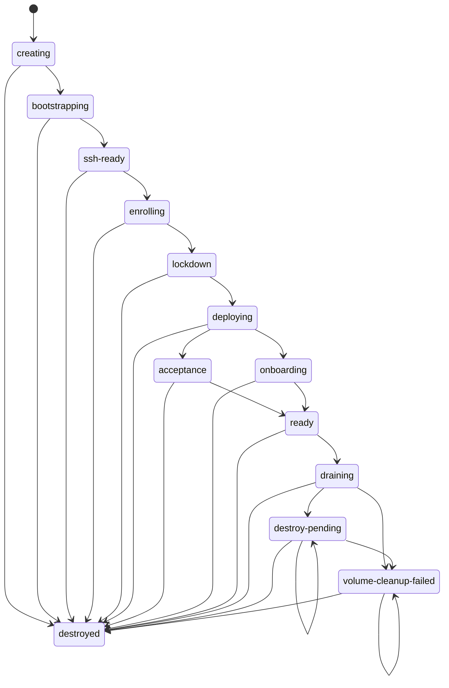

# Skillbox Architecture

This is the maintainer-grade system map for agents and operators. It names the
layers, manifests, modules, data paths, state ownership, and extension seams
that matter before changing the system.

## 1. Layer Diagram

```mermaid
flowchart TB
  subgraph operator["Operator machine"]
    boxpy["scripts/box.py<br/>DigitalOcean + Tailscale box lifecycle"]
    opmcp["scripts/operator_mcp_server.py<br/>operator MCP tools"]
    boxes["workspace/boxes.json<br/>box inventory"]
    guard["scripts/guard-destructive-op.sh<br/>destructive-op guard"]
  end

  subgraph host["Host / outer repo"]
    make["Makefile<br/>operator command facade"]
    compose["docker-compose.yml<br/>workspace container + optional surfaces"]
    tailscale["Tailscale + SSH<br/>tailnet access"]
    scripts["scripts/01-07<br/>bootstrap, Tailscale, reconcile, swimmers, upgrade, release"]
    reconcile["scripts/04-reconcile.py<br/>outer render / doctor"]
    state[".skillbox-state/<br/>durable local state root"]
  end

  subgraph container["Workspace container"]
    workspace["/workspace<br/>bind-mounted repo"]
    homes["/home/sandbox/.claude<br/>/home/sandbox/.codex"]
    clients["/workspace/workspace/clients<br/>client overlays"]
    logs["/workspace/logs<br/>runtime and service logs"]
    monoserver["/monoserver<br/>optional sibling repo universe"]
  end

  subgraph runtime["Runtime manager"]
    manage[".env-manager/manage.py<br/>runtime CLI facade"]
    cli["runtime_manager/cli.py<br/>argparse + dispatch"]
    model["scripts/lib/runtime_model.py<br/>build_runtime_model"]
    validation["runtime_manager/validation.py<br/>filter + validate"]
    ops["runtime_manager/runtime_ops.py<br/>sync, doctor, status, lifecycle ops"]
    pulse[".env-manager/pulse.py<br/>live reconciliation daemon"]
    inmcp[".env-manager/mcp_server.py<br/>in-box MCP tools"]
  end

  subgraph brain["Agent ops brain"]
    graph["agent_graph.py<br/>runtime graph"]
    algos["agent_graph_algorithms.py<br/>topology, cycles, critical path, unblock sets"]
    engine["agent_graph_engine.py<br/>graph command + renderers"]
    decisions["agent_decisions.py<br/>next + explain"]
    search["agent_search.py<br/>local search"]
    adapters["agent_adapters.py<br/>br, bv, sbp, ntm, pulse evidence"]
  end

  opmcp --> boxpy
  opmcp --> compose
  opmcp --> reconcile
  boxpy --> boxes
  boxpy --> tailscale
  boxpy --> scripts
  guard --> opmcp
  make --> reconcile
  make --> compose
  compose --> container
  state --> homes
  state --> clients
  state --> logs
  state --> monoserver
  workspace --> manage
  manage --> cli
  cli --> model
  model --> validation
  validation --> ops
  ops --> pulse
  cli --> inmcp
  validation --> graph
  adapters --> graph
  graph --> algos
  algos --> engine
  graph --> decisions
  graph --> search
```

## 2. Manifest Roles Table

| Manifest | Role |
|---|---|
| `workspace/sandbox.yaml` | Container shape. It declares the sandbox name and purpose, tailnet/Docker runtime mode, workspace user, exposed ports, runtime paths such as `/workspace`, `/workspace/repos`, `/workspace/logs`, `/home/sandbox/.claude`, `/home/sandbox/.codex`, `/monoserver`, and entrypoints (`ssh`, `manual`, `api`, `swimmers`, `web`). `scripts/04-reconcile.py` reads it for the outer render/doctor model. |
| `workspace/dependencies.yaml` | Surface categories. It documents the things the box may mount, clone, install, or run: home mounts, repo workspaces, skill roots, packaged skill bundles, runtime artifacts, connector source repos, and runtime services. It is descriptive input to outer validation and a stable map of "what kinds of surfaces exist" before the richer runtime graph scopes them. |
| `workspace/runtime.yaml` | Operational graph. This is the inner runtime declaration consumed by `scripts/lib/runtime_model.py`: repos, artifacts, skill repo sets, services, tasks, logs, checks, bridges, service modes, ingress routes, and client/profile scopes. `.env-manager/manage.py` filters it by `--client` and `--profile`, then `runtime_ops.py` syncs, validates, starts, stops, and reports it. |
| `workspace/persistence.yaml` | State bindings. It declares `SKILLBOX_STATE_ROOT`, local vs DigitalOcean state targets, and runtime-path bindings such as `/home/sandbox/.claude -> home/.claude`, `/home/sandbox/.codex -> home/.codex`, `/workspace/workspace/clients -> clients`, `/workspace/logs -> logs`, and `/monoserver -> monoserver`. `compile_persistence_summary()` resolves these into host paths and storage checks. |
| `workspace/skill-repos.yaml` | Skill supply chain. It declares portable skill sources (`repo`, `ref`, `pick`) that `sync_skill_repo_sets()` clones under `workspace/skill-repos/`, lockfiles under `workspace/*.lock.json`, and filtered installs into the managed Claude/Codex homes. Private/operator-only skills belong in overlays or external config, not this public default manifest. |

## 3. Module Inventory

`ls .env-manager/runtime_manager/*.py | wc -l` currently reports 48 top-level
runtime-manager Python modules.

| Module | Responsibility | Key entry points |
|---|---|---|
| `__init__.py` | Package facade that re-exports the runtime manager public namespace. | package imports |
| `_skill_common.py` | Dependency-free skill visibility primitives: layer ranks, path matching, source buckets, machine path helpers. | `DISPATCHER_CORE`, layer-rank constants, `_path_*` helpers |
| `agent_adapters.py` | Bounded read-only adapters that normalize optional local tools into evidence packets. | `collect_agent_adapter_evidence`, `run_command_adapter`, `runtime_evidence_adapter` |
| `agent_cli_hints.py` | Stable copy-paste command hints for brain payloads. | `manage_py_command` |
| `agent_decisions.py` | Recommendation and explain engine for the brain. | `next_action_payload`, `explain_payload`, `resolve_brain_target` |
| `agent_errors.py` | Shared typed brain error envelope. | `brain_error_payload` |
| `agent_graph.py` | Typed runtime graph builder over model, registry, workflow, and adapter evidence. | `GraphNode`, `GraphEdge`, `AgentGraph`, `build_agent_graph`, `build_agent_graph_payload` |
| `agent_graph_algorithms.py` | Deterministic graph algorithms and algorithm registry. | `register_algorithm`, `analyze_graph`, `cycle_evidence`, `critical_path`, `min_unblock_set` |
| `agent_graph_engine.py` | `manage.py graph` payload builder and text/DOT/Mermaid renderers. | `graph_command_payload`, `render_graph_payload`, `graph_to_mermaid` |
| `agent_search.py` | Deterministic local search over registry, graph, docs, Beads, and evidence. | `search_payload` |
| `agent_snapshots.py` | Redacted brain snapshot create/diff/replay support. | `create_snapshot_payload`, `save_snapshot`, `diff_snapshots`, `replay_snapshot` |
| `agent_timing.py` | Small timing helpers for brain payload latency fields. | `timer_start`, `attach_elapsed` |
| `audit_report.py` | Skill visibility snapshot, issue groups, broken-link taxonomy, audit rows, explain view, and text renderers. | `collect_skill_visibility`, `collect_skill_audit`, `print_skill_visibility_text` |
| `cli.py` | Main runtime CLI: parser construction, command dispatch, text/JSON output routing. | `main`, `_EARLY_COMMANDS`, `_MODEL_COMMANDS`, `command_registry` |
| `command_registry.py` | Shared capabilities ABI for CLI, MCP, generated docs, and brain command nodes. | `CommandSpec`, `default_registry`, `validate_registry`, `registry_payload` |
| `context_rendering.py` | Generated agent context from the resolved runtime model and live state. | `generate_context_markdown`, `generate_live_context_markdown`, `sync_context`, `sync_live_context` |
| `endpoints.py` | Operator-facing endpoint summaries and service-row annotations after starts. | `service_endpoint_exposure`, `annotate_service_rows`, `build_endpoint_summary` |
| `errors.py` | Runtime typed error hierarchy and back-compatible JSON error envelope. | `SkillboxError`, `ValidationError`, `StateConflictError`, `internal_error_payload` |
| `evidence.py` | Read-only runtime evidence packet joining doctor, status, pressure, pulse, skills, MCP, git, and Beads pointers. | `collect_runtime_evidence`, `runtime_evidence_markdown`, `print_runtime_evidence_text` |
| `fleet_converge.py` | Read-only fleet-wide skill/MCP drift plan grouped into relink, prune, sync, policy, and MCP actions. | `build_fleet_converge_plan`, `fleet_converge_text_lines` |
| `fleet_relink.py` | Machine-migration relink planner/applier for foreign skill symlinks. | `resolve_relink_roots`, `build_relink_plan`, `apply_relink_plan`, `relink_text_lines` |
| `forge.py` | Skill Forge setup, scoring status, proposal, accept, and reject workflows. | `forge_init`, `forge_status`, `forge_propose`, `forge_accept`, `forge_reject` |
| `graph_cycle_evidence.py` | Pure shared cycle/SCC leaf used by validation and graph algorithms. | `normalize_graph`, `strongly_connected_components`, `cycle_evidence` |
| `inventory.py` | Skill source discovery, installed occurrence inventory, global-home resolution, and parity. | `resolve_global_homes`, `global_home_surfaces_report`, `collect_skill_parity` |
| `lifecycle.py` | Mutating skill lifecycle plans: link, unlink, sync, prune, and overlay activation. | `skill_lifecycle_plan`, `apply_skill_lifecycle_plan`, `activate_overlay_scoped_skills` |
| `machines.py` | Machine profile loading, current-machine detection, alias canonicalization, and cross-machine path translation. | `MachinesConfig`, `MachineProfile`, `load_machines_config`, `detect_machine_id` |
| `mcp_render.py` | Single-source MCP renderer for `.mcp.json` and `.codex/config.toml`. | `canonical_server_map`, `collect_mcp_render`, `render_mcp_sync` |
| `mcp_visibility.py` | Claude/Codex MCP parity audit against declared `kind:mcp` runtime services. | `collect_mcp_audit`, `print_mcp_audit_text` |
| `mmdx_open.py` | Fuzzy finder/opener for repo-local Mermaid/MMDX diagrams. | `mmdx_open_payload`, `mmdx_error_payload`, `print_mmdx_payload_text` |
| `operator_booking.py` | Client-configured human-operator booking/availability surface. | `operator_booking_payload`, `operator_booking_error_payload` |
| `parity_report.py` | Read-only dev/prod parity report for one client runtime graph. | `collect_dev_prod_parity_report`, `emit_dev_prod_parity_report` |
| `policy_eval.py` | Skill scope policy, overlays, machine/registry resolution, and effective overlay state. | `active_overlays`, `overlay_scoped_skill_names` |
| `port_registry.py` | Machine-readable port registry built conservatively from resolved services, ingress, and env surfaces. | `build_port_registry`, `port_registry_payload`, `port_registry_text_lines` |
| `pressure_report.py` | Disk pressure and storage guard posture report. | `collect_pressure_report`, `pressure_report_text_lines` |
| `publish.py` | Client projection/publish/diff/open metadata, bundle comparison, and acceptance metadata. | `publish_client_bundle`, `diff_runtime_models`, `build_client_publish_metadata` |
| `rch_adapter.py` | No-sudo RCH staging plan for pressure-aware remote compilation. | `build_rch_stage_plan`, `rch_stage_text_lines` |
| `rch_report.py` | Read-only RCH worker/check/hook readiness report. | `collect_rch_report`, `rch_report_text_lines` |
| `registry_docs.py` | Deterministic Markdown/API reference rendering from the command registry. | `render_api_reference`, `registry_docs_payload` |
| `runtime_ops.py` | Runtime sync, doctor, status, service/task dependency ordering, logs, health probes, and lifecycle primitives. | `sync_runtime`, `doctor_results`, `runtime_status`, `run_tasks`, `start_services`, `stop_services` |
| `sbh_report.py` | Read-only Storage Ballast Helper posture report with release caveats. | `collect_sbh_report`, `sbh_report_text_lines` |
| `shared.py` | Shared filesystem, subprocess, JSON/YAML, redaction, session, worker, client scaffold, skill sync, and projection helpers. | `build_runtime_model`, `atomic_write_text`, `log_runtime_event`, `create_worker_run`, `start_client_session` |
| `shared_distribution.py` | Distribution-specific `skill-repos.yaml` schema parsing and validation. | `parse_distributors`, `parse_distributor_set_source`, `validate_distribution_config` |
| `skill_visibility.py` | Back-compatible facade that re-executes the split skill visibility modules into one namespace. | facade imports for `_skill_common`, `policy_eval`, `inventory`, `audit_report`, `lifecycle` |
| `structure_doctor.py` | `sbp doctor` structural gate runner with PASS/FAIL/INCO semantics. | `build_context`, `run_structure_doctor`, `structure_doctor_text_lines` |
| `swimmers_launch.py` | Batch launcher for Swimmers sessions from local directories/prompts. | `build_swimmers_launch_payload`, `launch_swimmers_batch`, `swimmers_launch_text_lines` |
| `text_renderers.py` | Human text renderers for runtime graph, doctor, status, actions, logs, brain search/explain, and graph errors. | `print_render_text`, `print_doctor_text`, `print_status_text`, `print_service_actions_text` |
| `validation.py` | Runtime model filtering, active scope normalization, skill checks, dependency cycle/dangling checks, connector and parity validation. | `build_runtime_model`, `normalize_active_profiles`, `normalize_active_clients`, `filter_model`, `validate_runtime_model` |
| `workflows.py` | Higher-level workflows for onboard, first-box, acceptance, focus, stewardship, and local-runtime `up`. | `run_onboard`, `run_first_box`, `run_acceptance`, `run_focus`, `run_stewardship_report`, `run_up` |

## 4. Data Flow

```mermaid
flowchart LR
  runtimeYaml["workspace/runtime.yaml"] --> build["build_runtime_model<br/>scripts/lib/runtime_model.py"]
  envFiles[".env.example + .env + process env"] --> build
  persistenceYaml["workspace/persistence.yaml"] --> build
  clientOverlays["workspace/clients/*/overlay.yaml"] --> build
  build --> defaults["host-path defaults<br/>persistence summary<br/>runtime id validation"]
  defaults --> active["normalize_active_profiles<br/>normalize_active_clients"]
  active --> filter["filter_model<br/>profile/client scope + required refs"]

  filter --> lifecycle["runtime_ops.py<br/>sync, doctor, status, bootstrap, up, down, logs"]
  filter --> context["context_rendering.py<br/>CLAUDE.md + AGENTS.md"]
  filter --> mcp["mcp_render.py / mcp_visibility.py<br/>declared MCP surfaces"]
  filter --> graph["agent_graph.build_agent_graph"]

  registry["command_registry.default_registry"] --> graph
  adapters["agent_adapters.collect_agent_adapter_evidence<br/>br, bv, sbp, ntm, pulse, runtime evidence"] --> graph
  graph --> algorithms["agent_graph_algorithms<br/>topology, SCC, cycles, critical path, unblock sets"]
  algorithms --> graphCommand["agent_graph_engine.graph_command_payload"]
  graph --> decisions["agent_decisions<br/>next_action_payload + explain_payload"]
  graph --> search["agent_search.search_payload"]
```

## 5. Box Lifecycle State Machine

This diagram is a direct rendering of `VALID_TRANSITIONS` in `scripts/box.py`.



## 6. State Layout

`find .skillbox-state -maxdepth 3 -type d` currently shows local directories for
`clients`, `dryrun-markers`, `home`, `logs`, `operator`, `rch-adapter`,
`rch-canary`, `snapshots`, and `worker-runs`; `monoserver` is also a declared
persistent binding even when absent on a given checkout.

| Path | Owner / writer |
|---|---|
| `.skillbox-state/` | `SKILLBOX_STATE_ROOT`; `workspace/persistence.yaml` declares the root and `runtime_ops.validate_storage_posture()` checks existence, ownership, filesystem, free space, and off-root persistent bindings. |
| `.skillbox-state/operator/` | Operator-only secret home for live `.env` and `.env.box`; `.env.example` documents this as the preferred location because repo-root secrets are bind-mounted into the container. |
| `.skillbox-state/home/.claude/` | Persistent Claude home; `context_rendering.py`, `mcp_render.py`, and skill sync/lifecycle code write generated context, MCP config, and installed skills. |
| `.skillbox-state/home/.codex/` | Persistent Codex home; same writers as Claude, including generated `AGENTS.md`, Codex MCP TOML, and installed skills. |
| `.skillbox-state/home/.local/` | Managed in-box user tools and downloaded artifacts; `runtime_ops.sync_artifact()` and runtime sync write binaries such as swimmers, dcg, rch, sbh, cass/cm, and related local state. |
| `.skillbox-state/home/.config/` | Persistent tool configuration under the managed user home, including `ntm` and optional RCH/SBH configs declared by manifests. |
| `.skillbox-state/clients/` | Host backing store for `/workspace/workspace/clients`; `client-init`, `onboard`, `private-init`, and publish/open workflows write overlays and client-safe surfaces. `runtime_model.load_client_overlays()` reads `*/overlay.yaml`. |
| `.skillbox-state/logs/runtime/` | Runtime journal, pulse pid/state/log, ingress artifacts, and service manager events; written by `runtime_ops.log_runtime_event()`, `.env-manager/pulse.py`, and lifecycle operations. |
| `.skillbox-state/logs/api/`, `.skillbox-state/logs/web/`, `.skillbox-state/logs/swimmers/` | Service log roots for optional stub and swimmers surfaces, declared in `runtime.yaml` and written by service launches. |
| `.skillbox-state/logs/clients/<client>/` | Durable client session timelines; session functions in `shared.py` write `meta.json`, `events.jsonl`, and handoff records. |
| `.skillbox-state/monoserver/` | Declared persistent backing store for `/monoserver`; used as the optional sibling-repo universe when configured. |
| `.skillbox-state/snapshots/agent_ops/` | Redacted brain snapshots; only `manage.py snap create --write` through `agent_snapshots.save_snapshot()` writes here. |
| `.skillbox-state/dryrun-markers/` | Dry-run gate markers for mutating MCP/runtime/operator tools; written and cleared by `.env-manager/mcp_server.py` and `scripts/operator_mcp_server.py`. |
| `.skillbox-state/worker-runs/` | Broker-managed worker run state; `shared.create_worker_run()`, `worker_status_payload()`, `worker_artifacts_payload()`, and learning promotion helpers read/write here. |
| `.skillbox-state/rch-adapter/` and `.skillbox-state/rch-canary/` | RCH staging/canary state for remote compilation helper workflows; written by `rch_adapter.py` and related tests/proofs. |
| `.skillbox-state/pruned-skill-repo-extras-*` | Archive locations created by skill cleanup/prune workflows to preserve removed extras for review. |

## 7. Extension Recipes

### Add a Command

1. Put new behavior in the narrowest leaf module; keep `cli.py` as parsing and dispatch glue.
2. Add argparse wiring in `cli.py`; use `_EARLY_COMMANDS` if the command does not need a filtered runtime model and `_MODEL_COMMANDS` if it does.
3. Add a `CommandSpec` in `command_registry.default_registry()` with surfaces, side effect, risk, scopes, examples, validations, and graph node references.
4. Add an in-box MCP mirror in `.env-manager/mcp_server.py` only when agents should call it as a tool; if it mutates, wire it into the dry-run marker gate.
5. Update focused tests: `tests/test_cli_dispatch.py`, `tests/test_agent_ops_command_registry.py`, MCP tests when mirrored, and golden/API-reference tests if the registry output changes.
6. Verify with `python3 -m unittest tests.test_agent_ops_command_registry tests.test_cli_dispatch` plus the feature-specific test file.

### Add a Service

1. Declare the service in `workspace/runtime.yaml` or a client `overlay.yaml` with `id`, `kind`, `profiles`, `repo` or `artifact`, `command`, `healthcheck`, `log`, and any `depends_on` / `bootstrap_tasks`.
2. If the service needs new env placeholders, add them to `.env.example`, `RUNTIME_ENV_KEYS`, and derived defaults in `scripts/lib/runtime_model.py`.
3. If it owns a stable port, prefer an explicit healthcheck URL or port; add env-port keys to `port_registry.py` only for env-declared surfaces.
4. If it is an MCP server, add the `kind: mcp` service plus the matching server body in `.mcp.json`; `mcp_render.py` and `mcp_visibility.py` consume the declaration.
5. Verify with `python3 .env-manager/manage.py render --format json`, `doctor --format json`, and `up --dry-run --profile <profile> --service <id>`.

### Add an Adapter

1. Keep adapters bounded, local, read-only, timeout-protected, and redacted; missing optional binaries must degrade to evidence warnings.
2. Add normalization code in `agent_adapters.py` or a new leaf module with the same result shape: source, kind, ok/status, duration, payload, warnings, previews.
3. Join it in `collect_agent_adapter_evidence()` so the brain gets one adapter map.
4. If evidence should become graph nodes, confirm `_add_adapter_evidence()` in `agent_graph.py` can ingest the payload items.
5. Cover failures and redaction in `tests/test_agent_ops_adapters.py`; cover graph/decision use in `tests/test_agent_ops_graph.py` or `tests/test_agent_ops_decisions.py`.

### Add a Graph Algorithm

1. Implement the pure algorithm in `agent_graph_algorithms.py` over `normalize_graph()` output; do not depend on live filesystem state.
2. Register it with `register_algorithm(AlgorithmSpec(...))`, including a params schema and optional text renderer.
3. If it introduces new parameters, extend `agent_graph_engine.graph_command_payload()` validation and `cli.py` parser flags.
4. Update the `brain.graph` `CommandSpec` enum/examples in `command_registry.py` when the public algorithm name changes.
5. Verify with `tests/test_agent_ops_graph_algorithms.py`, `tests/test_agent_ops_graph_engine.py`, and the registry/golden tests when the public ABI changes.
